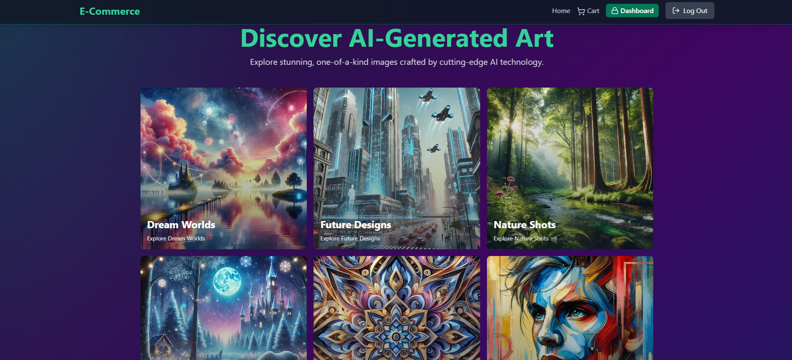

# AI-Generated Image Store - QA 

## Overview

This repository is a testing environment for the **AI-Generated Image Store**, an e-commerce platform where users can explore and purchase AI-generated images. The repository focuses on comprehensive quality assurance, covering all components, including the Node.js backend, React frontend, and integrations like Stripe and Cloudinary.

---

## Purpose

- Test all features of the application with unit, integration, and end-to-end tests.
- Ensure platform reliability, security, and performance.
- Showcase quality assurance skills using modern tools and methodologies.

---

## Features Under Testing

- **Product Browsing & Purchase Workflow**: End-to-end user experience testing.
- **User Authentication & Authorization**: Secure access control validation.
- **Payments Integration**: Stripe API payment workflows.
- **Image Management**: Cloudinary-based image uploads and retrievals.
- **Admin Functionality**: Product and order management tools.
- **API & Database**: RESTful APIs, MongoDB operations, and Redis caching.

---

## Testing Tools and Frameworks

- **Frontend Tests**: Jest, React Testing Library, Cypress
- **Backend Tests**: Mocha, Chai, Supertest
- **API Tests**: Postman, Newman
- **Performance Tests**: Artillery, Apache JMeter
- **CI/CD**: Automated testing with GitHub Actions

---

## Build & Deploy

### Prerequisites
- **Node.js**, **npm**, **MongoDB**, **Redis**, and Stripe API keys

### Steps

#### Backend
1. Navigate to `backend/` and install dependencies:
   ```bash
   cd backend
   npm install

- MONGODB_URI=<your-mongodb-uri>
- REDIS_URL=<your-redis-url>
- STRIPE_SECRET_KEY=<your-stripe-secret-key>

npm start

cd frontend
npm install

Update src/lib/axios.js with the backend URL.

npm run build

##Technologies
- Backend: Node.js, Express.js, MongoDB, Redis, Stripe
- Frontend: React.js, Vite, TailwindCSS

## License
This project is licensed under the MIT License. See the [MIT License](LICENSE) file for more details.

## Notes
This repository demonstrates:
- **Comprehensive Testing**: Thorough unit, integration, and performance testing of a full-stack application.
- **Debugging and Optimization**: Proficiency in identifying, resolving, and optimizing application issues.
- **Modern QA Practices**: Practical use of industry-standard tools and workflows to ensure high-quality, reliable software.
